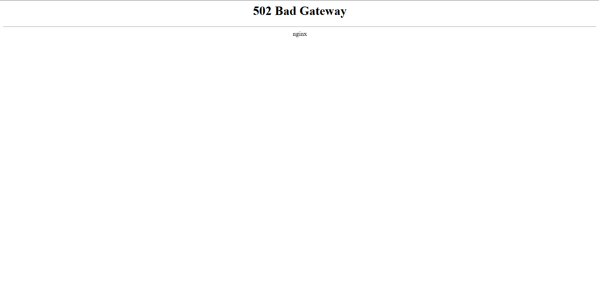

# ⚠️ Error Handling & Troubleshooting

NodeCP provides a seamless experience, but sometimes you may encounter errors due to misconfigurations, system resource limitations, or unexpected failures. This guide helps diagnose and fix common issues quickly.

---

## 🛑 **502 Bad Gateway (Nginx)**

**Issue:**  
Encountering a **502 Bad Gateway** error means NodeCP's backend service is either not running or has experienced an issue.

**Example Screenshot:**  


**Solution:**  
Restart the NodeCP backend service using the command below:

```bash
systemctl restart nodecp
```

After the service restarts, refresh your browser to verify NodeCP is functioning again.

---

## 🚧 **Panel Inaccessible due to Firewall Restrictions**

**Issue:**  
Sometimes your panel might become inaccessible even though the firewall seems active and functioning.

**Possible Reason:**  
Firewall rules could be blocking necessary ports unintentionally.

**Recommended Action:**  
Try temporarily disabling your firewall to check if it resolves the connectivity issue:

- For `UFW` firewall:
  ```bash
  ufw disable
  ```

- For `CSF` firewall:
  ```bash
  csf -x
  ```

If disabling the firewall fixes the issue, review your firewall rules and ensure the correct ports (such as 80, 443, 22, and the NodeCP-specific ports) are allowed through the firewall.

After troubleshooting, re-enable the firewall with:

- For `UFW` firewall:
  ```bash
  ufw enable
  ```

- For `CSF` firewall:
  ```bash
  csf -e
  ```

Make sure to open necessary ports explicitly in your firewall rules:
- `HTTP (80)`
- `HTTPS (443)`
- `SSH (22)`
- `NodeCP Panel specific port (default might vary based on your installation, commonly 8080 or another custom port)`

---

## 📌 **Common Troubleshooting Commands**

### **Checking NodeCP service status:**
```bash
systemctl status nodecp
```

### 🔄 **Restart NodeCP Service**:
```bash
systemctl restart nodecp
```

### 📜 **View NodeCP Logs**:
```bash
journalctl -u nodecp --no-pager -n 50
```

or
```bash
cat /var/log/nodecp/error.log
```

---

## 🚨 **Common Error Solutions**

| Error                  | Possible Cause                          | Suggested Action                                                                                 |
|------------------------|---------------------------------------------------|
| **503 Service Unavailable** | Backend overload or downtime | Restart NodeCP: `systemctl restart nodecp` |
| **403 Forbidden** | Permission/ownership issues | `chown -R www-data:www-data /var/www/nodecp` |
| **Firewall Blocking Access** | Firewall misconfiguration | Temporarily disable firewall & test connectivity |

---

## 🧯 **Firewall Management**

If encountering connectivity issues, check if required ports are allowed:

**Essential ports for NodeCP**:
- HTTP → `80/tcp`
- HTTPS → `443/tcp`
- SSH → `22/tcp`

**Open necessary ports with**:
```bash
# UFW Example
ufw allow 80/tcp
ufw allow 443/tcp
ufw allow 22/tcp
ufw reload
```

or edit the **CSF** configuration (`/etc/csf/csf.conf`), then restart:

```bash
csf -r
```

**Important:**  
Only disable the firewall for testing purposes. Always re-enable it after identifying and resolving the issue.

---

## 📗 **Further Assistance**

For more detailed troubleshooting information:
- Consult [NodeCP Documentation](https://docs.nodecp.com)
- Visit our [Community Forum](#)
- Contact NodeCP's dedicated **Support Team**

---

🎉 **With NodeCP's simplified troubleshooting, resolve issues quickly and efficiently!** 🚀
