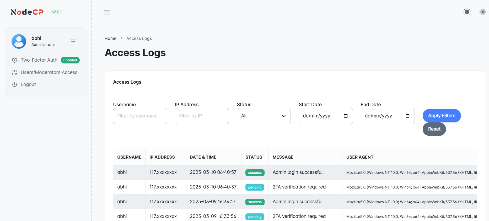

# Access Logs

## Overview

The **Access Logs** feature in NodeCP allows administrators to track user activities, login attempts, and other system interactions. It helps in auditing security events, detecting unauthorized access, and troubleshooting login issues.

---

## 1️⃣ **Viewing Access Logs**

The **Access Logs** page provides detailed records, including:
- **Username** ➜ The user who performed the action.
- **IP Address** ➜ The originating IP address.
- **Date & Time** ➜ When the action occurred.
- **Status** ➜ Indicates whether the action was successful, pending, or failed.
- **Message** ➜ Additional details (e.g., "Admin login successful").
- **User Agent** ➜ The browser or client used to access the system.

---

## 2️⃣ **Filtering Access Logs**

You can refine the log view using multiple filters:

### **Filter Options:**
1. **Username** ➜ Search logs by specific users.
2. **IP Address** ➜ Check logs from a particular IP.
3. **Status** ➜ Select logs based on success, pending, or failed actions.
4. **Date Range** ➜ Filter logs within a specific time frame.

### **Steps to Filter Logs:**
1. Enter the **Username** or **IP Address** (optional).
2. Select the **Status** (e.g., success, pending, failed).
3. Choose the **Start Date** and **End Date**.
4. Click **"Apply Filters"**.

> 🔄 **Click "Reset"** to clear filters and view all logs.

---

## 3️⃣ **Understanding Log Statuses**
| Status   | Description |
|----------|------------|
| ✅ **Success** | Action was completed successfully (e.g., login successful). |
| ⏳ **Pending** | Action requires further verification (e.g., 2FA required). |
| ❌ **Failed** | Action was unsuccessful (e.g., incorrect password attempt). |

---

## 4️⃣ **Why Access Logs Matter?**
- ✅ **Security Monitoring** ➜ Detect unauthorized login attempts.
- ✅ **Audit Trails** ➜ Track user actions and system access.
- ✅ **Troubleshooting** ➜ Identify login or system errors.

> 🔍 **Regularly reviewing logs helps maintain system security and compliance.**

---

## 🔐 **Best Practices for Log Monitoring**
- **Enable Two-Factor Authentication (2FA)** for added security.
- **Monitor failed login attempts** to detect possible attacks.
- **Review user activity periodically** to ensure compliance.
- **Investigate unknown IP addresses** accessing your system.

---

🎯 **With NodeCP’s Access Logs, tracking user activity is effortless and efficient!** 🚀
