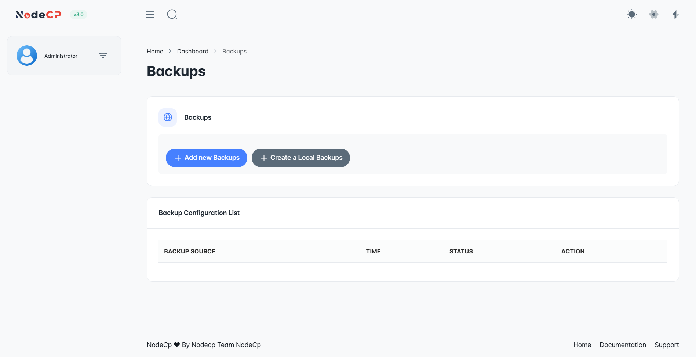
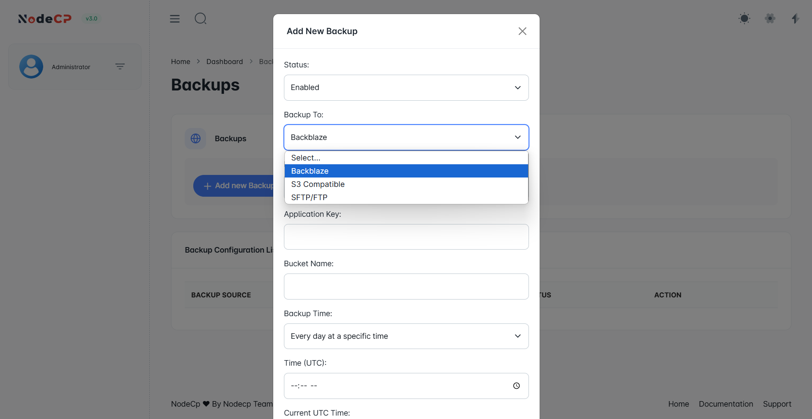
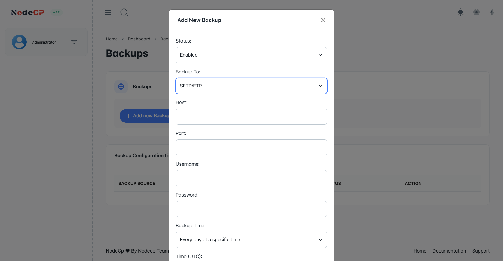

# Backup Management

## Overview

NodeCP provides a **comprehensive backup system**, allowing users to:
- ✅ **Set up automatic backups** with **cloud storage** integration.
- ✅ **Create instant backups** stored locally.
- ✅ **Schedule backups** at specific times in **UTC format**.

Backups ensure **data safety** in case of system failures, accidental deletions, or migrations.

---

## 1️⃣ **Backup Options & Storage Providers**



Users can choose between:
- **📅 Automatic Backups** ➜ Scheduled backups stored in:
  - ☁️ **S3 Compatible Storage (AWS, DigitalOcean Spaces, etc.)**
  - 🔥 **Backblaze B2 Cloud Storage**
  - 🌍 **FTP/SFTP Remote Servers**
- **⚡ Instant Backups** ➜ Creates a local backup in:
  - 📂 `/home/localbackup/`

---

## 2️⃣ **Setting Up an Automatic Backup**

### **Step 1: Add a New Backup**



To set up an **automatic backup**:
1. Click **"Add New Backup"**.
2. Select **Backup Destination**:
   - 🌍 **Backblaze**
   - ☁️ **S3 Compatible Storage**
   - 🔗 **FTP/SFTP**
3. Provide the required fields based on the selected backup type.
4. Set a **Backup Schedule**:
   - **Every day** at a set time.
   - **Custom time (UTC)**.
5. Click **"Save Backup"**.

> ⏳ **Scheduled backups will run automatically based on the configured time.**

---

## 3️⃣ **Backup Storage Configuration Details**

### ☁️ **S3 Compatible Storage (AWS, DigitalOcean, etc.)**
For **S3-Compatible Storage**, you need:
- **Access Key ID** ➜ Used for authentication.
- **Secret Access Key** ➜ Secure authentication key.
- **Bucket Name** ➜ The S3 bucket where backups are stored.
- **Region** ➜ AWS, DigitalOcean Spaces, or any S3 provider’s region.
- **Endpoint URL** *(optional)* ➜ Custom endpoint for non-AWS providers.

> **Example: AWS S3 Backup Configuration**
```
Access Key ID: AKIAEXAMPLE123
Secret Access Key: ********************
Bucket Name: my-backups
Region: us-east-1
Endpoint URL: https://s3.amazonaws.com
```

> **Ensure your bucket permissions allow write access from your server.**

---

### 🔥 **Backblaze B2 Cloud Storage**
For **Backblaze B2**, provide:
- **Application Key** ➜ Secure key for authentication.
- **Key ID** ➜ Associated with your Backblaze account.
- **Bucket Name** ➜ Name of the Backblaze B2 bucket.
- **Backup Schedule** ➜ Choose when backups should run.

> **Example: Backblaze B2 Configuration**
```
Application Key: K000EXAMPLE456
Key ID: 000EXAMPLE789
Bucket Name: nodecp-backups
```

> **Ensure the bucket is public or has private API access enabled.**

---

### 🌍 **FTP/SFTP Backup**
For **FTP/SFTP backups**, provide:
- **Host** ➜ IP address or domain of the FTP/SFTP server.
- **Port** ➜ Connection port (Default: `21` for FTP, `22` for SFTP).
- **Username** ➜ FTP/SFTP account username.
- **Password** ➜ Associated password.
- **Remote Directory** ➜ Folder where backups will be stored.
- **Backup Schedule** ➜ Specify the time for automated backups.



> **Example: FTP/SFTP Configuration**
```
Host: backup.myserver.com
Port: 22
Username: nodecp_backup
Password: ********
Remote Directory: /backups
```

> **Ensure the FTP/SFTP server allows incoming backup connections and has write permissions.**

---

## 4️⃣ **Creating an Instant Backup**

To manually back up your data:
1. Click **"Create Local Backup"**.
2. The system will:
   - 📂 Save the backup in `/home/localbackup/`
   - ✅ Show the backup **status** once complete.

> **Instant backups are not scheduled** and must be triggered manually.

---

## 5️⃣ **Restoring a Backup**
To restore data from a backup:
1. Locate the backup file in **your storage provider or `/home/localbackup/`**.
2. Download the backup file.
3. Extract and **restore your database and files manually**.

> **Restoration must be done manually to prevent overwriting important data.**

---

## 🛠 **Best Practices for Backup Management**

| Task | Recommendation |
|------|---------------|
| **Backup Frequency** | Schedule daily or weekly backups for critical data |
| **Storage Choice** | Use cloud storage (S3, Backblaze) for remote safety |
| **Encryption** | Encrypt sensitive backups before storing remotely |
| **Testing Backups** | Regularly verify backup integrity by restoring files |

---

## 🔒 **Security & Data Protection**
- **Use strong credentials** for FTP/SFTP backups.
- **Store cloud access keys securely**.
- **Monitor storage usage** to prevent backup failures.
- **Encrypt backups before uploading them to remote storage**.

---

🎯 **NodeCP simplifies backup automation, ensuring data security and reliability!** 🚀
