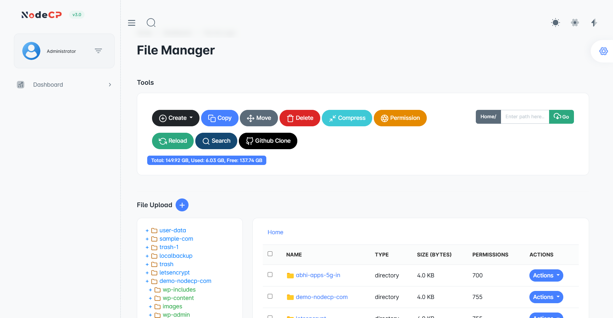

# File Manager

NodeCP's File Manager is a **secure, fast, and user-friendly** file management tool designed for seamless server file operations.

## Features of Each Button

- **Create** ➜ Add new files or directories.
- **Upload** ➜ Supports **multiple file uploads** at once.
- **Copy** ➜ Duplicate selected files or folders.
- **Move** ➜ Move files/folders to another location.
- **Delete** ➜ Permanently remove selected items.
- **Delete to Trash** ➜ Move files/folders to the trash instead of permanently deleting them.
- **Compress** ➜ Archive files into a compressed format (e.g., `.zip`, `.tar`).
- **Extract** ➜ Extract compressed files (supports `.zip`, `.tar`, `.gz` formats).
- **Rename** ➜ Rename files or directories.
- **Edit** ➜ Modify text-based files directly in the browser using an in-built editor.
- **Download** ➜ Download selected files from the server.
- **Permissions** ➜ Modify file permissions (CHMOD) for better security.
- **Reload** ➜ Refresh the file list to view the latest changes.
- **Search** ➜ Quickly find files or directories.
- **Github Clone** ➜ Clone a repository directly into the file system.

## Security and Reliability
NodeCP's File Manager ensures **top-notch security** with:
- **Encrypted file transfers** to protect your data.
- **Role-based access control** for restricted file modifications.
- **Real-time logging** for better monitoring.
- **Trash system** for accidental deletions, allowing recovery before permanent deletion.

Experience a **secure and efficient** file management system with NodeCP! 🚀
