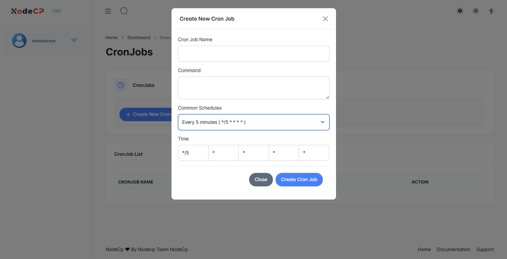

# Cron Jobs Management

## Overview

A **Cron Job** is a scheduled task that runs at specified intervals on your server. It is used for:
- ✅ Automating repetitive tasks (e.g., backups, script execution).
- ✅ Running scheduled scripts at fixed times.
- ✅ Managing **system maintenance** and **scheduled processes**.

---

## 1️⃣ **Creating a New Cron Job**



To set up a cron job:
1. Click **"Create New Cron Job"**.
2. Enter:
   - **Cron Job Name** (e.g., `Daily Backup`).
   - **Command** (The script to execute).
3. Select a predefined **Common Schedule** *(e.g., every 5 minutes, daily, weekly, etc.)*.
4. Customize the **Time Expression** if needed.
5. Click **"Create Cron Job"**.

> 🛠 **Example Cron Job Commands**:
```sh
0 3 * * * /usr/bin/php /home/user/script.php  # Runs script.php at 3 AM daily
*/5 * * * * /home/user/backup.sh  # Runs backup.sh every 5 minutes
