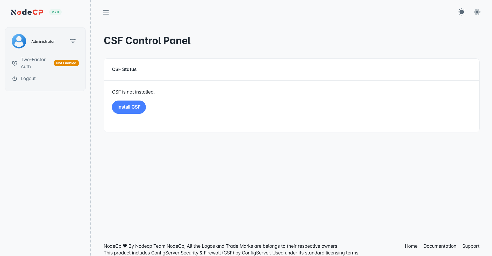

# ConfigServer Security & Firewall (CSF)

## Overview

NodeCP integrates with **ConfigServer Security & Firewall (CSF)**, an advanced, robust, and powerful firewall management tool that provides comprehensive security for your server.

### ✅ **Features of CSF:**
- Easy installation via NodeCP.
- User-friendly management interface for firewall configuration.
- Protection against unauthorized access and malicious attacks.

---

## 1️⃣ **Installing CSF Firewall**

To use CSF, it must first be installed.

### Installation Steps:

1. Navigate to **Dashboard → CSF**.
2. Click the **"Install CSF"** button.
3. The system will automatically download and install the latest version from **[ConfigServer](https://www.configserver.com)**.
4. Wait until installation completes; the status will automatically update.

> **Note:** Installation may take a few minutes to complete.

---

## 2️⃣ **Managing Firewall with CSF**

After successful installation, you can:

- ✅ **Create Firewall Rules**
- ✏️ **Edit existing rules**
- ❌ **Delete rules**
- 🔄 **Restart CSF Firewall**

### **Creating a Firewall Rule:**

- Click **"Create New Firewall Record"**.
- Configure the rule by selecting:

| Field      | Description                                    | Example                 |
|------------|----------------------------------------------------|
| **Protocol** | `TCP` or `UDP` |
| **Action**   | **Allow** or **Deny** |
| **Port**       | Specify the port number to allow/block |

- Click **"Save Record"** to apply the new rule.

### **Managing Firewall Rules:**

Existing firewall rules appear under the **Firewall List**, allowing easy management through NodeCP’s intuitive interface.

---

## 🔐 **Best Practices for Firewall Management**

- **Only allow essential ports** to limit security vulnerabilities.
- **Regularly review and update firewall rules**.
- **Ensure you understand** the implications of each firewall rule you create.
- **Keep firewall rules clear and organized** for efficient troubleshooting.

---

## 🚧 **Security Notice**
Misconfiguration of firewall settings can block access to your server or leave it vulnerable. Always proceed with caution.

---

🎯 **NodeCP's integration of ConfigServer Security & Firewall ensures robust, simple, and secure firewall management!** 🚀

---

**[Learn more about CSF at ConfigServer](https://configserver.com/cp/csf.html)** *(Open Source - Contribute and support the community!)*
