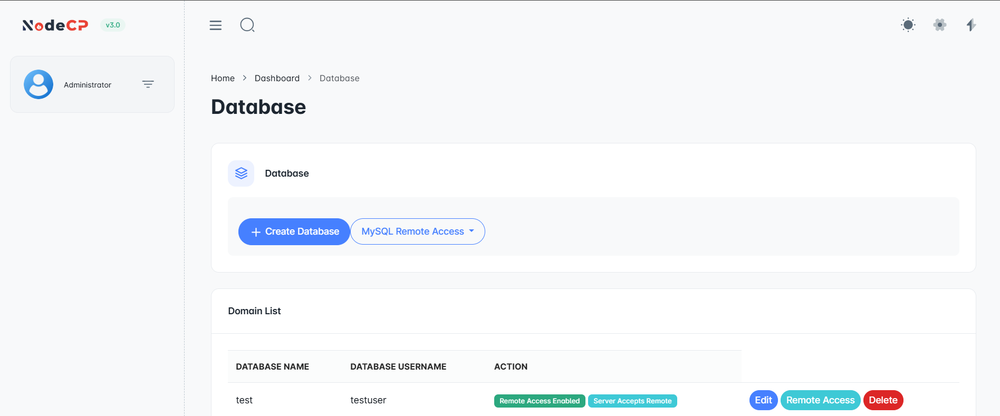
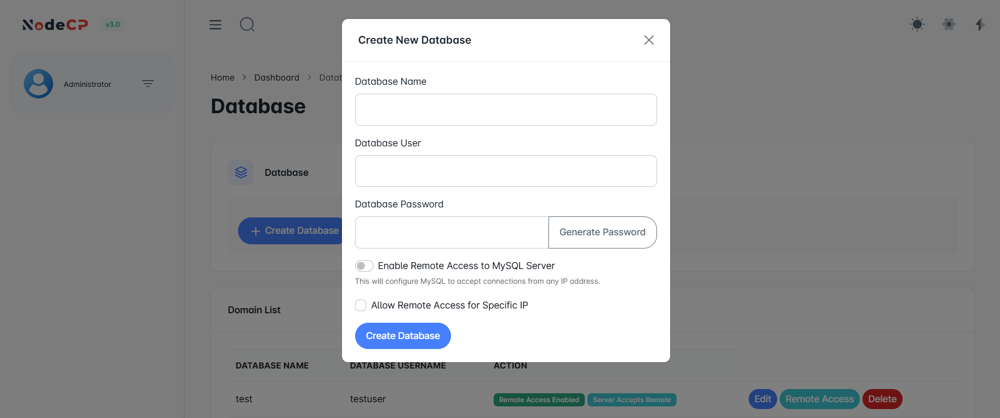

# Database Management

## Overview

NodeCP provides a **powerful database management interface**, allowing users to:
- ✅ Create and manage MySQL databases.
- ✅ Enable **remote database access** with **whitelisted IP addresses**.
- ✅ Securely log in to **phpMyAdmin** for database operations.

---

## 1️⃣ **Creating a New Database**

To create a database:
1. Click **"Create Database"**.
2. Enter:
   - **Database Name**
   - **Database Username**
   - **Database Password** *(or generate a secure one)*
3. **Enable Remote Access** *(optional)*:
   - Allow connections from **any IP**.
   - Restrict access to **specific IP addresses**.
4. Click **"Create Database"** to finalize.

---

## 2️⃣ **Managing Databases & Remote Access**

The **Database List** displays:
- **Database Name** & **Username**.
- **Remote Access Status**:
  - ✅ *"Remote Access Enabled"*: Connections allowed.
  - ✅ *"Server Accepts Remote"*: The server is configured to accept connections.
- **Actions**:
  - ✏️ **Edit Database**
  - 🌍 **Manage Remote Access**
  - ❌ **Delete Database**

---

## 3️⃣ **Logging into phpMyAdmin**

Once your database is created, you can **log into phpMyAdmin** for advanced management.

### **Steps to Access phpMyAdmin:**
1. Open the **phpMyAdmin URL** in your browser.
2. Enter:
   - **Username**: Your database username.
   - **Password**: The associated password.
3. Click **"Log in"** to access and modify your database.

---

## 🔐 **Security Recommendations**
- **Use strong passwords** for database users.
- **Restrict remote access** to **trusted IPs only**.
- **Regularly back up** databases to prevent data loss.
- **Use phpMyAdmin for controlled access** instead of direct MySQL root login.

---

🎯 **With NodeCP, managing MySQL databases is simple, secure, and efficient!** 🚀
