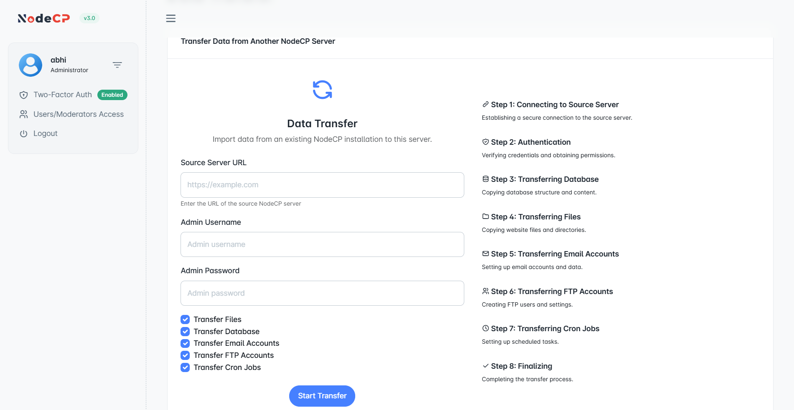

# Data Transfer

## Overview

The **Data Transfer** feature in NodeCP allows administrators to migrate data from an existing NodeCP server to a new one. This ensures a seamless transition of databases, files, emails, FTP accounts, and cron jobs.

---

## 1️⃣ **How to Transfer Data from Another NodeCP Server**

This tool simplifies the migration process in **8 easy steps**.

### **Step 1: Enter Source Server Details**
1. **Source Server URL** ➜ Enter the full URL of the source NodeCP server.
2. **Admin Username** ➜ Provide admin credentials of the source server.
3. **Admin Password** ➜ Enter the correct admin password.

> 🔒 **Ensure the source server is accessible and has the correct permissions for data migration.**

---

## 2️⃣ **Select Data to Transfer**
You can choose what data should be migrated:
- ✅ **Transfer Files** ➜ Move website files and directories.
- ✅ **Transfer Database** ➜ Copy all MySQL databases and tables.
- ✅ **Transfer Email Accounts** ➜ Migrate email accounts and settings.
- ✅ **Transfer FTP Accounts** ➜ Transfer FTP users and credentials.
- ✅ **Transfer Cron Jobs** ➜ Copy scheduled tasks.

> ✨ **By default, all options are selected** to ensure a complete migration.

---

## 3️⃣ **Migration Process: Step-by-Step**
The transfer process follows these steps:

### 🔗 **Step 1: Connecting to Source Server**
- Establishes a secure SSH connection to the source server.

### 🔑 **Step 2: Authentication**
- Verifies credentials and permissions before proceeding.

### 🗄 **Step 3: Transferring Database**
- Copies the database structure and content.

### 📂 **Step 4: Transferring Files**
- Transfers website files and directories.

### 📧 **Step 5: Transferring Email Accounts**
- Migrates all email configurations and data.

### 🔑 **Step 6: Transferring FTP Accounts**
- Moves FTP users and associated settings.

### ⏳ **Step 7: Transferring Cron Jobs**
- Copies scheduled tasks from the source server.

### ✅ **Step 8: Finalizing**
- Completes the transfer and verifies data integrity.

---

## 4️⃣ **Starting the Transfer**
1. Review all selected options.
2. Click the **"Start Transfer"** button.
3. Monitor progress as each step is executed.

> ⏳ **The transfer duration depends on the data size and network speed.**

---

## 🚀 **Why Use NodeCP Data Transfer?**
- ✅ **Fully automated process** ➜ No manual intervention required.
- ✅ **Secure connection** ➜ Uses encrypted authentication for safety.
- ✅ **Comprehensive migration** ➜ Ensures all data is transferred successfully.
- ✅ **Minimal downtime** ➜ Keeps your website and services running smoothly.

---

## 🛠 **Troubleshooting & Best Practices**
| Issue | Solution |
|-------|----------|
| **Connection error** | Verify source server URL and credentials. |
| **Database transfer fails** | Ensure MySQL access is allowed remotely. |
| **Files not transferring** | Check file permissions and disk space. |
| **Emails missing** | Confirm that email services are active on both servers. |

---

🎯 **NodeCP makes server migration seamless, secure, and hassle-free!** 🚀
