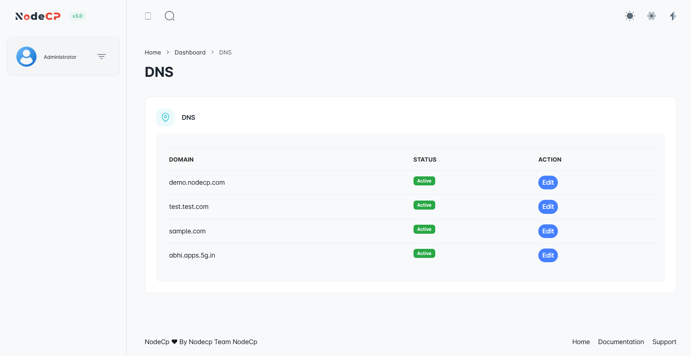
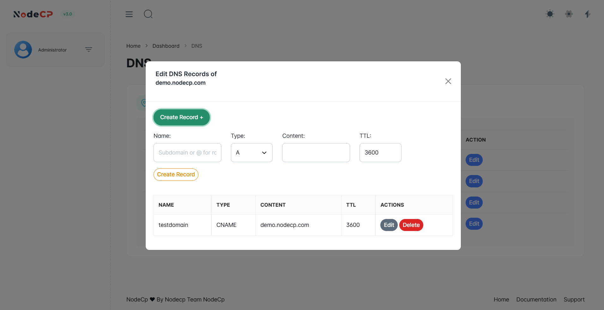

# DNS Management

## Overview

DNS (Domain Name System) is a crucial component of the internet that **translates domain names into IP addresses**. NodeCP provides an easy-to-use interface to manage DNS records efficiently.

---

## Viewing and Managing DNS Zones

### 📌 **Step 1: View Existing DNS Zones**

- This section lists all **domains** and their **status**.
- Click **"Edit"** to manage the DNS records of a specific domain.

---

## Creating and Editing DNS Records

### 📌 **Step 2: Edit DNS Records**

- Click **"Create Record +"** to add a new DNS entry.
- Enter:
  - **Name**: Subdomain or root (`@` for root domain).
  - **Type**: Select from A, MX, CNAME, AAAA, etc.
  - **Content**: The value associated with the record.
  - **TTL**: Time-to-Live (how long the record is cached).

---

## 🛠 Common DNS Record Types and Their Purpose

| Type   | Purpose |
|--------|---------|
| **A**  | Points a domain to an IPv4 address. |
| **AAAA** | Points a domain to an IPv6 address. |
| **CNAME** | Creates an alias for another domain name. |
| **MX** | Specifies mail servers for email delivery. |
| **TXT** | Stores arbitrary text, often used for verification (SPF, DKIM, etc.). |
| **NS** | Defines authoritative name servers for the domain. |
| **SRV** | Defines location (hostname + port) of specific services. |
| **PTR** | Reverse lookup to match an IP with a domain name. |

---

## Why Manage DNS?

- 🔹 Ensure proper **website resolution** (A/AAAA records).
- ✉️ Configure **email delivery** (MX records).
- 🔄 Set up **subdomains and aliases** (CNAME records).
- 🔑 Secure domains with **SPF, DKIM, and DMARC** (TXT records).

With **NodeCP’s DNS Manager**, handling **domain resolution, email routing, and security settings** is straightforward and efficient. 🚀
