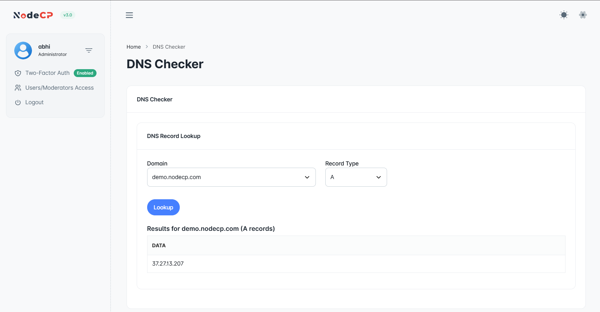

# DNS Checker

## Overview

NodeCP provides a **DNS Checker** tool that allows users to verify whether a domain’s **DNS records** are properly configured. This helps ensure that the domain resolves correctly and avoids connectivity issues.

---

## 1️⃣ **Checking DNS Records**

The **DNS Checker** allows users to lookup different types of DNS records, such as:
- **A Record** ➜ Maps a domain to an IPv4 address.
- **AAAA Record** ➜ Maps a domain to an IPv6 address.
- **CNAME Record** ➜ Aliases one domain to another.
- **MX Record** ➜ Specifies mail servers for the domain.
- **TXT Record** ➜ Stores text-based information, often used for verification (SPF, DKIM, etc.).
- **NS Record** ➜ Lists the authoritative name servers for the domain.

---

## 2️⃣ **Performing a DNS Lookup**

### **Steps to Check a DNS Record:**
1. Navigate to **Dashboard → DNS Checker**.
2. Select the **Domain** from the dropdown list.
3. Choose the **Record Type** (A, CNAME, MX, etc.).
4. Click **"Lookup"**.
5. The results will be displayed, showing the retrieved **DNS record data**.

> **Tip:** If the expected result is missing, ensure your DNS settings are properly configured at your domain registrar.

---

## 3️⃣ **Understanding DNS Results**

| Record Type | Purpose |
|-------------|---------|
| **A Record** | Points a domain to an IPv4 address. |
| **AAAA Record** | Points a domain to an IPv6 address. |
| **CNAME Record** | Creates an alias for another domain. |
| **MX Record** | Defines mail servers for email delivery. |
| **TXT Record** | Stores arbitrary text for SPF, DKIM, and domain verification. |
| **NS Record** | Specifies the authoritative name servers. |

> **Note:** DNS propagation may take time, typically between **5 minutes to 48 hours**, depending on TTL (Time-To-Live) settings.

---

## 🔍 **Why Use DNS Checker?**
- ✅ **Quickly validate domain configurations**.
- ✅ **Troubleshoot email or website resolution issues**.
- ✅ **Ensure proper DNS propagation** after making changes.

---

🎯 **With NodeCP’s DNS Checker, verifying domain records is simple and efficient!** 🚀
