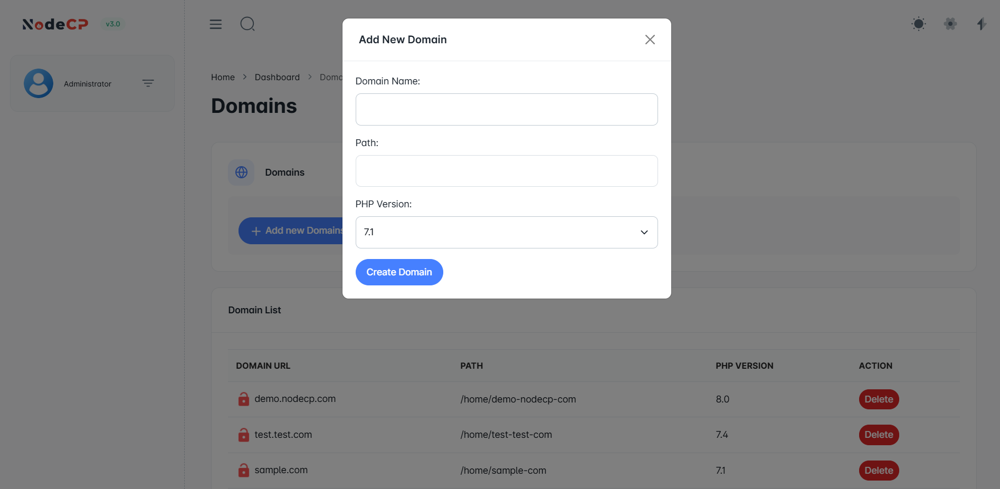

# Domain Management

NodeCP allows you to **set up domains** effortlessly while choosing a PHP version that best suits your project.

## Setting Up a New Domain

To add a domain:
1. Click **"Add new Domain"**.
2. Enter the **Domain Name** (e.g., `example.com`).
3. Specify the **Path** where the domain files will be stored (e.g., `/home/example-com`).
4. Select the **PHP Version** from the dropdown menu.
5. Click **"Create Domain"** to apply the settings.

## SSL Warning
🚨 **Important Notice:**  
If your domain does not have an SSL certificate installed, you will see a **red lock icon** next to it.  
- This means the website is **not secure** and may expose user data to threats.
- To fix this, ensure **SSL is properly configured** on your server.

## Domain List Features

- **Domain URL** ➜ Displays the domain name.
- **Path** ➜ Shows the directory where the website files are stored.
- **PHP Version** ➜ Lists the assigned PHP version.
- **Delete** ➜ Remove the domain from the server.

By managing your domains through NodeCP, you can efficiently assign **PHP versions, ensure SSL security, and maintain a structured directory system**.

---
🛠 **Ensure your domains are secure and properly configured with NodeCP!** 🚀
