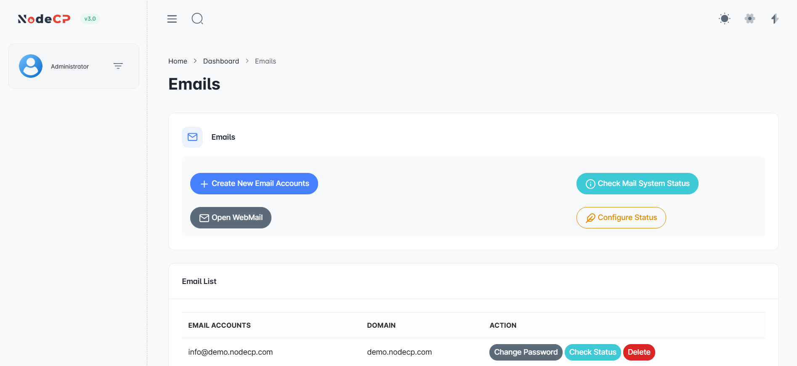
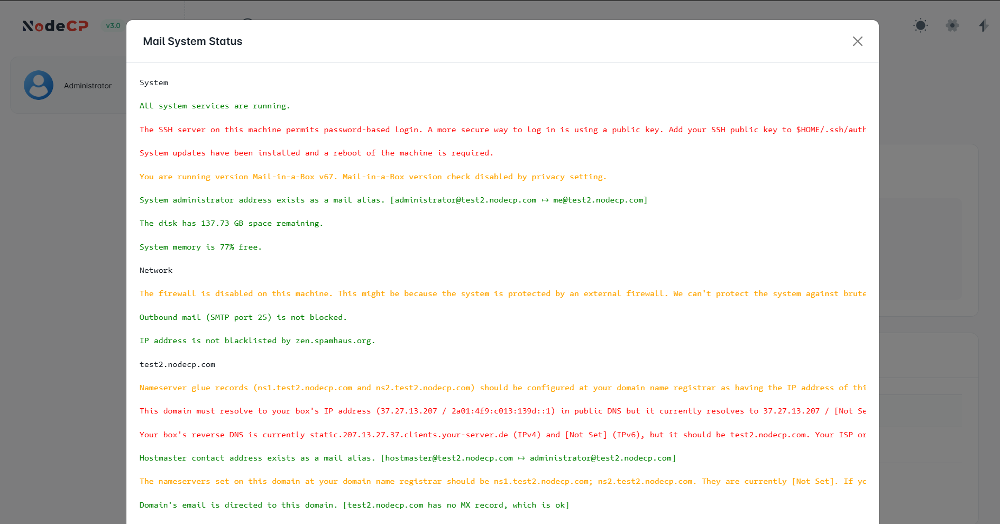
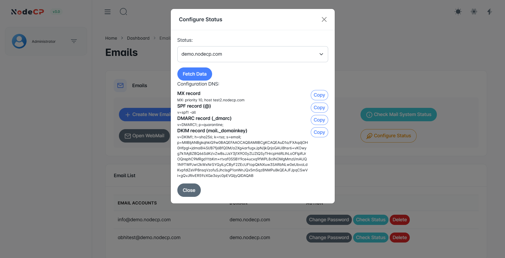
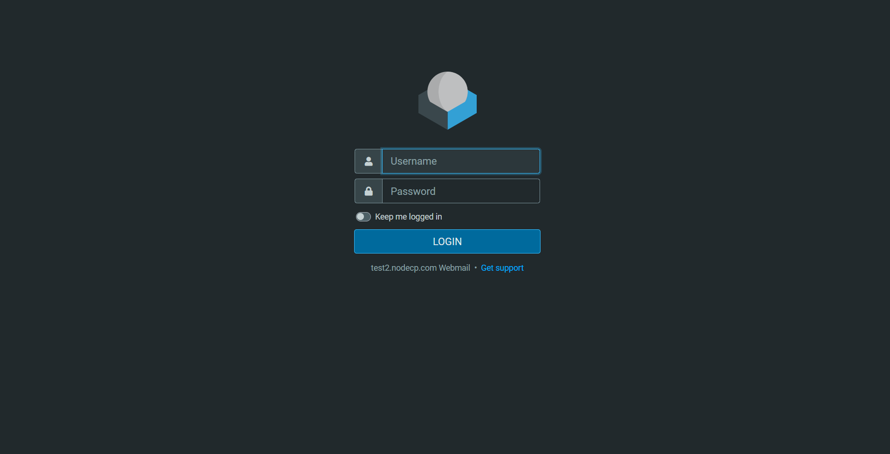

# Email Management

## Overview

NodeCP provides **email hosting capabilities** using [Mail-in-a-Box](https://mailinabox.email/) (open-source email server management) and **Roundcube** (a web-based email client).  

With NodeCP, you can:
- ✅ Create and manage **email accounts** for domains.
- ✅ **Check email system status**, including **IP blocks** and configuration details.
- ✅ **Configure mail settings** (MX, SPF, DMARC, DKIM).
- ✅ **Access Webmail** via Roundcube.

---

## 1️⃣ **Creating a New Email Account**

To create an email account:
1. Click **"Create New Email Account"**.
2. Select a **configured domain** from the dropdown list.
3. Enter:
   - **User Name** (e.g., `info`)
   - **Password** (or generate a strong one)
4. Click **"Create Account"**.

> ⚠️ If you see an **MX record error**, this means **MX, SPF, DKIM, or DMARC records are not set up**. You must configure them first.

---

## 2️⃣ **Checking Email System Status**

The **Check Mail System Status** option allows you to:
- ✅ Verify if all **email services are running**.
- ✅ Check **firewall and SMTP status**.
- ✅ Ensure that the server **IP is not blacklisted**.
- ✅ Identify any **configuration issues** related to **DNS, SPF, DKIM, DMARC, and MX records**.

> 🔴 Errors will be shown in **red**, while warnings appear in **orange**.

---

## 3️⃣ **Configuring Email DNS Settings**

To send and receive emails, you must set up **correct DNS records**.

The **Configure Status** page provides:
- **MX Record** ➜ Routes emails for your domain.
- **SPF Record** ➜ Prevents spoofing.
- **DMARC Record** ➜ Protects against phishing.
- **DKIM Record** ➜ Ensures email authenticity.

Click **"Copy"** to quickly copy the required DNS records and add them to your **domain registrar**.

---

## 4️⃣ **Accessing Webmail (Roundcube)**

To check emails:
1. Click **"Open Webmail"** in NodeCP.
2. This will launch **Roundcube Webmail**.
3. Enter your **email credentials**.
4. Click **"Login"** to access your inbox.

---

## 📜 **Open Source Licensing & Contribution**

### **Mail-in-a-Box**
- NodeCP uses [Mail-in-a-Box](https://mailinabox.email/) to manage email services.
- **License**: Open Source (MIT)
- We encourage contributions to improve its security and features.

### **Roundcube Webmail**
- NodeCP uses [Roundcube](https://roundcube.net/) for webmail access.
- **License**: Open Source (GPL)
- Contributions help enhance email usability and security.

---

## 🛠 **Troubleshooting & Best Practices**

| Issue | Cause | Solution |
|-------|-------|----------|
| **MX Record Error** | MX record is missing | Add MX record in domain DNS settings |
| **Emails Not Sending** | SMTP blocked | Check firewall & SMTP status |
| **Emails Going to Spam** | SPF/DKIM missing | Configure SPF & DKIM records |
| **Cannot Access Webmail** | Login issue | Ensure correct credentials & reset password if needed |

---

🎯 **With NodeCP, managing emails is secure, efficient, and fully customizable!** 🚀
