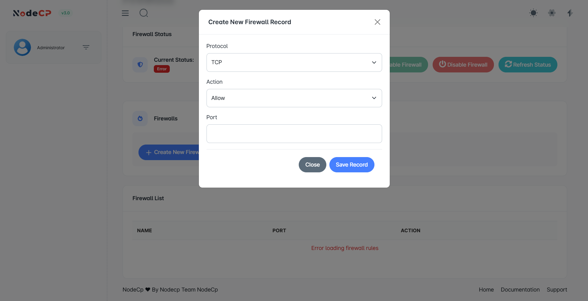

# Firewall Management 🔥

NodeCP offers an easy-to-use and efficient firewall management system, allowing you to manage your server's security rules seamlessly directly through its user-friendly interface.

---

## 🔐 Overview

The firewall feature helps you secure your server by:

- **Allowing or denying specific traffic** to your server.
- Ensuring only **authorized connections** are permitted.
- Providing a convenient way to manage firewall rules from a GUI.

---

## 📋 Firewall Status & Rules

The Firewall page displays:

- ✅ **Current Firewall Status** *(Enabled or Disabled)*
- ✅ **Existing Firewall Rules**:
  - Protocol
  - Action *(Allow or Deny)*
  - Ports specified
  - Management actions to edit or remove existing rules

---

## ➕ Adding New Firewall Rules

To create a new firewall rule:

Follow these steps:

1. Click **"Add New Firewall Record"**.
2. Specify the firewall rule settings:
   - **Protocol** *(TCP/UDP)*: Choose your protocol type.
   - **Action** *(Allow or Deny)*: Decide if you want to permit or block traffic.
   - **Port**: Enter the port number you wish to control (e.g., `22` for SSH).
3. Click **"Save Record"** to apply.

---

## 🔑 Common Ports & Usage Recommendations

| Service | Protocol | Default Port | Recommendation |
|-----------|-----------|------------------|
| SSH Access | TCP | 22 |
| HTTP (Web) | TCP | 80 |
| HTTPS (Secure Web) | TCP | 443 |
| FTP/SFTP File Transfer | TCP | 21, 22 |
| SMTP (Mail Sending) | TCP | 25, 465, 587 |
| MySQL Database Access | TCP | 3306 |

> **Important**: 
> - Open **only necessary ports** for security.
> - Limit SSH access strictly to known IP addresses.

---

## ⚠️ Troubleshooting Firewall Rules

If you encounter an error such as:

> ⚠️ "**Error loading firewall rules**"

Try the following steps:

- ✅ Ensure your firewall daemon (like `iptables` or `firewalld`) is running properly.
- ✅ Confirm you have adequate permissions to read firewall rules.
- ✅ Check system logs (`/var/log/syslog` or `/var/log/messages`) for detailed error messages.

---

## 🔐 Security Recommendations for Firewall Management

**Follow these best practices:**

- Always allow only **necessary ports and services**.
- Regularly audit and remove unused or unnecessary firewall rules.
- Limit incoming connections to specific **whitelisted IP addresses**.
- Regularly **review your firewall logs** to detect unauthorized access attempts.

---

🎯 **NodeCP Firewall Management helps you secure your server efficiently with ease!** 🚀

