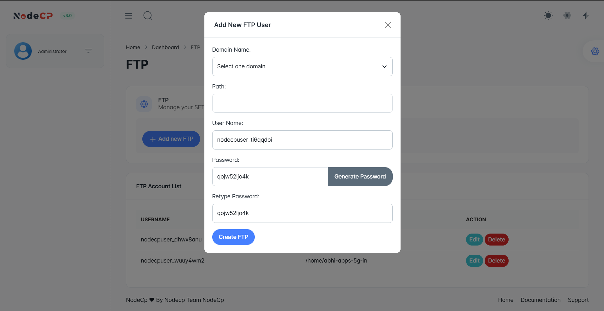

# FTP Management

## Overview

NodeCP allows users to **create and manage FTP accounts** for secure file transfers. Features include:
- ✅ **Multiple FTP accounts** based on user quota.
- ✅ **Custom directory paths** for FTP access.
- ✅ **Secure password generation** for FTP users.
- ✅ **Editing & deleting FTP accounts** easily.

> **Admin users** can create unlimited FTP accounts, while non-admin users have a quota limit.

---

## 1️⃣ **Creating a New FTP Account**



To create an FTP account:
1. Click **"Add new FTP"**.
2. Enter the required details:
   - **Domain Name** ➜ Select the domain associated with the FTP account.
   - **Path** ➜ Directory where FTP users will have access (leave empty for full access).
   - **User Name** ➜ Automatically generated or custom FTP username.
   - **Password** ➜ Enter manually or **generate a secure password**.
   - **Retype Password** ➜ Confirm the password.

3. Click **"Create FTP"**.
4. Once created, the new FTP account will be listed under the **FTP Account List**.

---

## 2️⃣ **Managing FTP Accounts**


The **FTP Account List** provides options to:

- **✏️ Edit** ➜ Modify username, password, or directory access.
- **❌ Delete** ➜ Remove the FTP account permanently.

> **Caution:** Deleting an FTP account **does not delete associated files**.

---

## 3️⃣ **Connecting to FTP**

To connect via an FTP client (FileZilla, WinSCP, Cyberduck, etc.), use the following details:

- **FTP Host** ➜ `ftp.yourdomain.com` or `server IP address`
- **Username** ➜ The FTP username created.
- **Password** ➜ The password set during creation.
- **Port** ➜ `21` for FTP, `22` for SFTP (secure).
- **Connection Mode** ➜ Passive (recommended).

> **Example Configuration in FileZilla:**
```
Host: ftp.example.com
Username: nodecpuser_example
Password: ********
Port: 21
```

---

## 4️⃣ **Secure FTP Practices**

- **Use SFTP instead of FTP** for encrypted connections.
- **Change passwords regularly** for security.
- **Restrict directory access** for specific FTP users.
- **Limit FTP accounts** for non-admin users based on **quota settings**.

---

## 🚀 **Why Use NodeCP for FTP Management?**
- **Unlimited FTP accounts for admins** ➜ No restrictions for server owners.
- **Custom directory access** ➜ Restrict FTP users to specific folders.
- **Password generator** ➜ Ensures strong credentials.
- **One-click management** ➜ Edit or remove accounts easily.

🎯 **NodeCP makes FTP management simple, efficient, and secure!** 🚀
