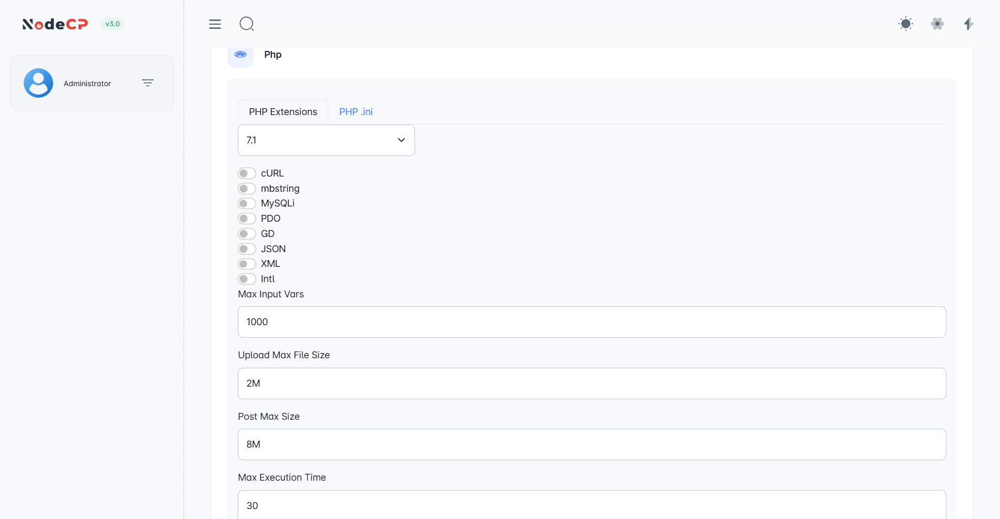
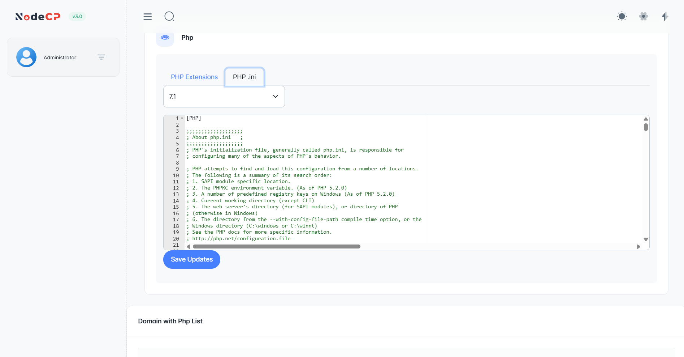
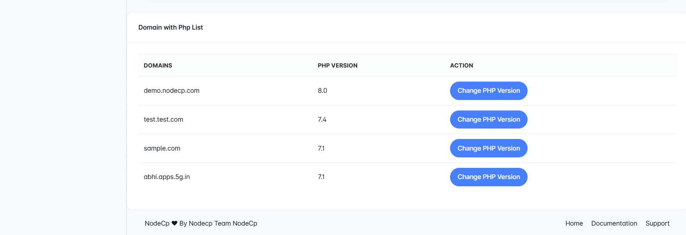

# PHP Management

## Overview

NodeCP offers a **comprehensive PHP management system**, enabling users to:
- ✅ Configure **PHP extensions** for different versions.
- ✅ Set **PHP ini settings** like upload size, max execution time, and memory limits.
- ✅ **Edit PHP.ini** files directly through the panel.
- ✅ **Set PHP versions** per domain for compatibility and flexibility.

---

## 1️⃣ **Managing PHP Extensions**

### **Available Features:**
- 🟢 Enable/Disable common PHP extensions:
  - cURL
  - mbstring
  - MySQLi
  - PDO
  - GD Library
  - JSON
  - XML
  - Intl
- 🔢 **Max Input Vars**: Set the maximum number of input variables.
- 📁 **Upload Max File Size**: Define maximum file upload size.
- 🚀 **Post Max Size**: Configure the maximum size of POST data.
- ⏱️ **Max Execution Time**: Set the script execution time limit.

> ⚙️ **Tip:** Make sure to only enable required extensions to optimize performance.

---

## 2️⃣ **Editing PHP.ini File**

### **Direct PHP.ini Editing:**
- 📝 Allows manual editing of the `php.ini` file.
- 📂 Supports all **PHP versions** installed on the server.
- 🛠️ Common configurable settings:
  - `memory_limit`
  - `upload_max_filesize`
  - `post_max_size`
  - `max_execution_time`
  - `max_input_time`

> 🧠 **Pro Tip:** Always take a backup of the `php.ini` file before making major changes.

---

## 3️⃣ **Setting PHP Versions Per Domain**

### **Supported PHP Versions:**
- PHP 5.6
- PHP 7.0, 7.1, 7.2, 7.3, 7.4
- PHP 8.0, 8.1, 8.2

### **How to Change PHP Version:**
1. Navigate to the **Domain with PHP List**.
2. Locate the domain you wish to configure.
3. Click **"Change PHP Version"**.
4. Select the desired PHP version from the dropdown menu.
5. Confirm the changes.

> ⚠️ **Compatibility Warning:** Ensure your application supports the selected PHP version.

---

## 🔥 **Common Use Cases:**

| Task | Recommended Setting |
|------|---------------------|
| **WordPress Hosting** | PHP 7.4 or PHP 8.0, `memory_limit = 256M` |
| **File Uploads** | `upload_max_filesize = 50M`, `post_max_size = 50M` |
| **Large Forms** | `max_input_vars = 5000` |
| **High Traffic Sites** | `max_execution_time = 300` |

---

## 🔒 **Security Tips:**

- 🚫 **Disable unused extensions** to reduce attack vectors.
- 🔑 Set `open_basedir` to limit script access to specific directories.
- 💡 Avoid exposing PHP version by setting `expose_php = Off` in `php.ini`.

---

🎯 **NodeCP's PHP Management ensures your server is optimized and secure, tailored to your application's needs!** 🚀

