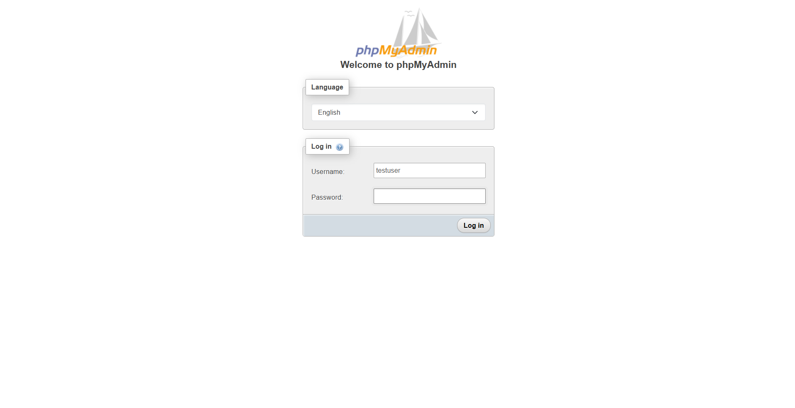

# phpMyAdmin Access

## Overview

Once a database is created in NodeCP, users can **access phpMyAdmin** to manage and modify their database efficiently.

---

## Accessing phpMyAdmin

### 📌 **Steps to Login**
1. Open **phpMyAdmin** from your control panel.
2. Select your preferred **language**.
3. Enter:
   - **Username**: The database username you created.
   - **Password**: The corresponding password.
4. Click **"Log in"**.

---

## Features of phpMyAdmin

| Feature | Description |
|---------|------------|
| **Database Management** | Create, modify, and delete databases. |
| **Table Management** | Add, edit, or remove tables within a database. |
| **SQL Execution** | Run custom SQL queries for advanced database operations. |
| **User Privileges** | Assign and manage database user permissions. |
| **Import/Export** | Backup and restore databases in various formats (SQL, CSV, etc.). |
| **Search** | Quickly locate records within tables. |

---

## Security Tips for phpMyAdmin

🔐 **Ensure database security** by:
- Using **strong passwords** for MySQL users.
- **Restricting access** to phpMyAdmin with IP-based protection.
- Regularly **backing up databases** to prevent data loss.
- Avoiding direct **root user** login for security.

With **NodeCP**, database management is simple and secure. Access **phpMyAdmin** to take full control of your databases! 🚀
