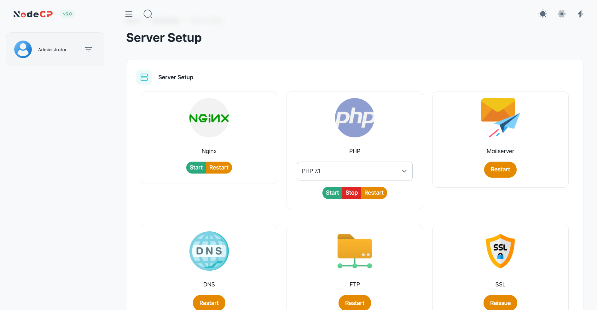

# ⚙️ Server Management

NodeCP provides a **powerful and user-friendly** interface to manage server services efficiently. Using the **Server Management** module, you can **start, stop, restart, or reissue** essential services with a **single click**.

---

## 🖥️ **Overview of Server Management**

The **Server Management** panel allows you to control the following services:

| **Service**  | **Actions Available**  |
|-------------|----------------------|
| 🌐 **Nginx Web Server** | Start, Restart |
| 🛠️ **PHP** | Start, Stop, Restart (Select PHP version) |
| 📧 **Mail Server** | Restart |
| 🌍 **DNS Service** | Restart |
| 📂 **FTP Service** | Restart |
| 🔒 **SSL Certificates** | Reissue |

---

## 🚀 **Managing Server Services**

Each server service has dedicated action buttons:

### ✅ **Starting a Service**
To start a service:
1. Click **"Start"** on the respective service.
2. The service should initialize and display an active status.

### 🔄 **Restarting a Service**
To restart a service:
1. Click **"Restart"**.
2. The service will restart immediately.

### 🛑 **Stopping a Service (For PHP)**
For PHP, you can stop a specific version:
1. Select the PHP version from the dropdown.
2. Click **"Stop"**.
3. To restart, click **"Start"**.

---

## 🛠 **Managing SSL Certificates**

If an SSL certificate is expired or invalid:
1. Click **"Reissue"** under the **SSL section**.
2. The system will attempt to generate a new **Let's Encrypt SSL certificate**.
3. If reissuance fails, ensure:
   - The domain has the correct **DNS settings**.
   - The domain is **accessible over the internet**.

---

## 📌 **Common Issues & Fixes**

| Issue | Possible Fix |
|-------|-------------|
| ❌ Service does not start | Check if another process is using the same port |
| ⚠️ Restart fails | Ensure the service is installed properly |
| 🔒 SSL Reissue fails | Verify domain DNS and Let's Encrypt configurations |
| 📧 Mail Server issues | Ensure SMTP ports are not blocked |

---

## 🔐 **Best Practices for Server Management**
- **Restart services periodically** to maintain performance.
- **Monitor service logs** (`/var/log/`) for troubleshooting.
- **Keep services updated** to prevent security vulnerabilities.

---

🎯 **NodeCP Server Management helps you control all critical services with ease!** 🚀
