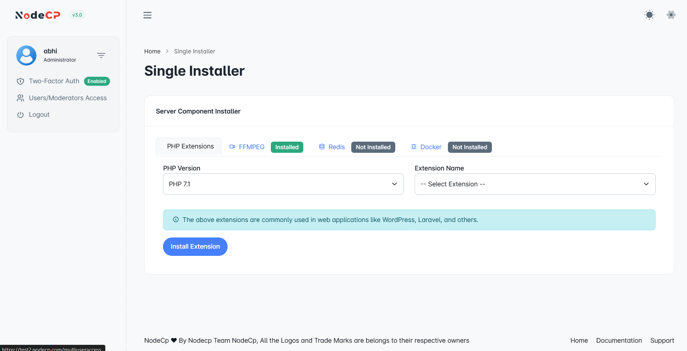
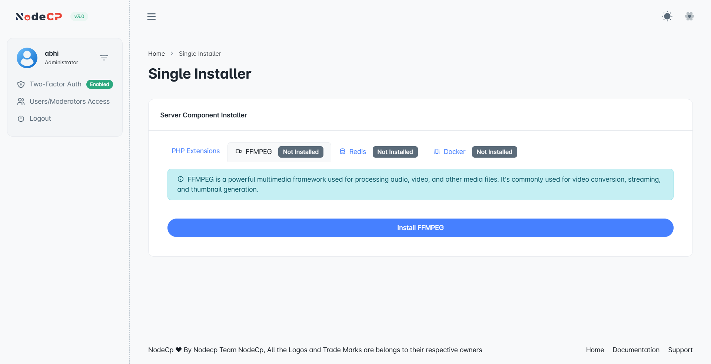
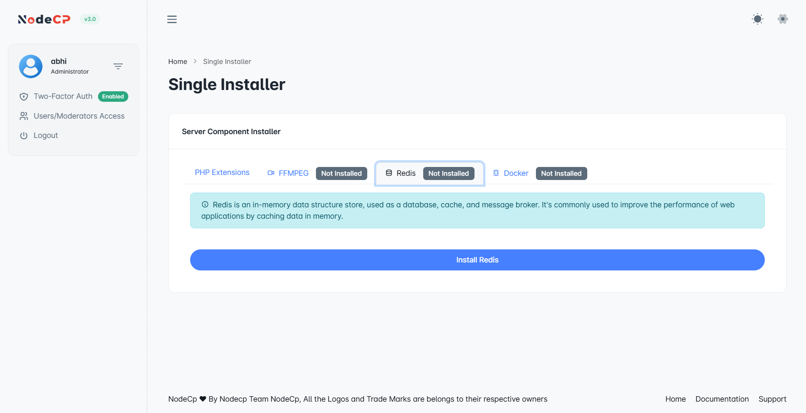
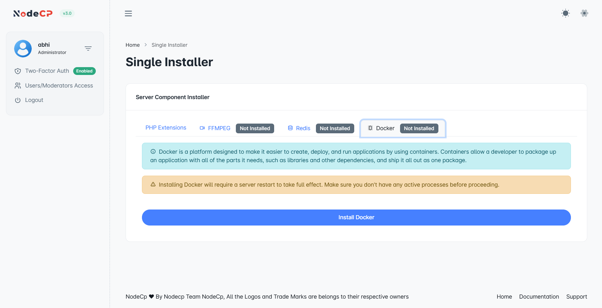

# Single Installer

## Overview

NodeCP provides a **Single Installer** feature that allows users to install essential server components with a single click. This simplifies the installation of commonly used dependencies such as **PHP Extensions, FFmpeg, Redis, and Docker**.

---

## 1️⃣ **Installing PHP Extensions**

PHP extensions are required for various web applications, including **WordPress, Laravel, and others**.

### **Steps to Install a PHP Extension:**
1. Navigate to **Dashboard → Single Installer**.
2. Select **PHP Extensions**.
3. Choose the **PHP Version** from the dropdown.
4. Select the **Extension Name** from the list.
5. Click **"Install Extension"**.
6. The installation will begin, and a confirmation will appear upon success.

> **Tip:** Some PHP extensions require restarting the server for changes to take effect.

---

## 2️⃣ **Installing FFmpeg (Multimedia Processing)**

FFmpeg is essential for **video and audio processing**, commonly used in streaming services, media platforms, and video editing tools.

### **Steps to Install FFmpeg:**
1. Click **FFmpeg** under the **Server Component Installer** section.
2. If not installed, click the **"Install"** button.
3. Wait for the process to complete.
4. Once installed, the status will change to **"Installed"**.

---

## 3️⃣ **Installing Redis (In-Memory Database & Cache)**

Redis is a **high-performance caching system** that speeds up database queries and optimizes web applications.

### **How to Install Redis:**
1. Click on **Redis** in the **Server Component Installer** section.
2. If Redis is not installed, click **"Install Redis"**.
3. Wait for the installation to complete.
4. The status will update accordingly.

> **Note:** Redis requires proper configuration to function efficiently.

---

## 4️⃣ **Installing Docker (Containerization Platform)**

Docker allows applications to run in isolated environments, making software deployment more efficient.

### **Installing Docker:**
1. Click on **Docker** under the **Server Component Installer** section.
2. If Docker is not installed, click **"Install Docker"**.
3. Wait for the installation to finish.
4. Docker will be ready for containerized applications.

---

## 🔍 **Component Installation Status**
- ✅ **Installed** ➜ The component is already installed and available.
- ⚠️ **Not Installed** ➜ The component is missing and needs to be installed.

---

## ⚡ **Why Use the Single Installer?**
- **🛠️ One-Click Installation** ➜ No need for manual commands.
- **🚀 Quick & Easy Setup** ➜ Install multiple components from a single interface.
- **💾 Essential for Web Applications** ➜ Supports WordPress, Laravel, Media Services, and more.

---

🎯 **With NodeCP’s Single Installer, managing server components has never been easier!** 🚀
