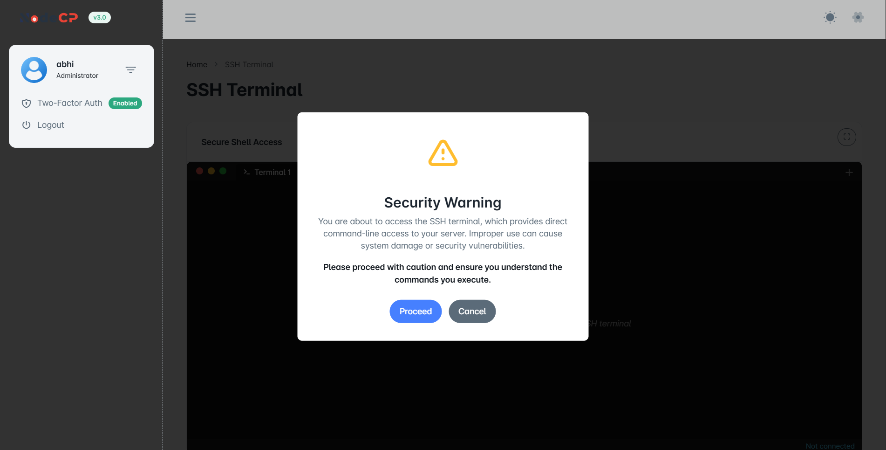
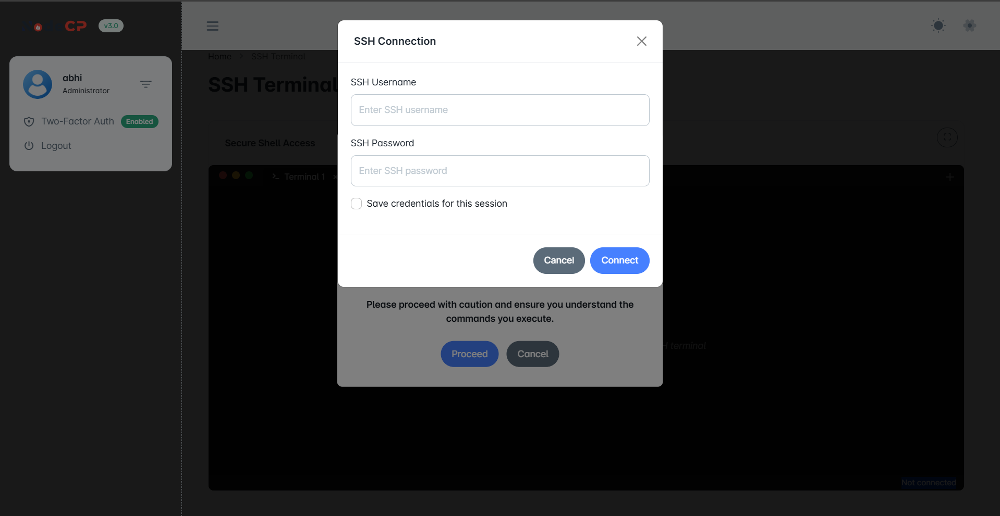
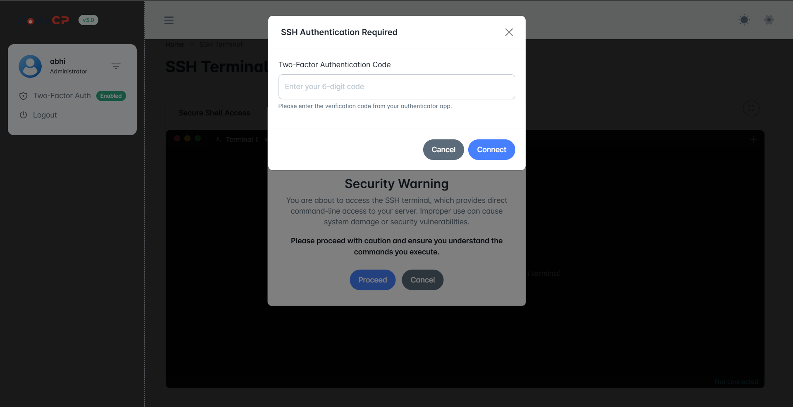
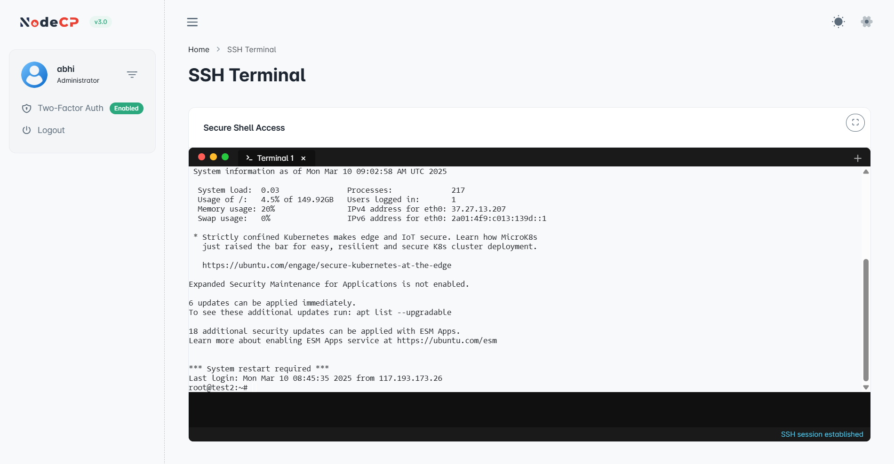

# SSH Terminal Access

## Overview

NodeCP provides a **secure SSH Terminal** for remote command-line access. It allows users to:
- ✅ **Securely connect** to the server using SSH authentication.
- ✅ **Supports multiple SSH sessions** simultaneously.
- ✅ **Two-Factor Authentication (2FA) support** for enhanced security.

---

## 1️⃣ **Accessing the SSH Terminal**

When opening the **SSH Terminal**, a **security warning** appears:

- Click **"Proceed"** to continue.
- Click **"Cancel"** to abort.

> **Warning:** SSH provides direct system access. **Use commands with caution!** 🚨

---

## 2️⃣ **Logging into SSH**

After proceeding, the system prompts for **SSH credentials**:

### **Enter:**
- **SSH Username** (e.g., `root`, `admin`, or a limited user)
- **SSH Password** (associated with the user)

> ✅ *Optionally, select "Save credentials for this session" for convenience.*

Click **"Connect"** to proceed.

---

## 3️⃣ **Two-Factor Authentication (2FA) (if enabled)**

If **2FA (Two-Factor Authentication)** is enabled, an additional prompt appears:

- Enter the **6-digit code** from your **authentication app** (e.g., Google Authenticator, Authy).
- Click **"Connect"** to finalize authentication.

> 🛡️ **Enabling 2FA improves security against unauthorized access!**

---

## 4️⃣ **Using the SSH Terminal**

Once connected, the SSH terminal opens:

🔹 **Key Features:**
- 📟 **Full interactive shell access** to the server.
- 🔄 **Supports multiple SSH sessions** (tabs).
- 🚀 **Execute Linux commands directly**.

> **Tip:** Type `exit` to close the SSH session.

---

## 🛠 **Best Practices for Secure SSH Access**

| 🔐 Security Measure | ✅ Recommendation |
|----------------|------------------|
| **Use SSH Keys** | Prefer **SSH key authentication** over passwords. |
| **Enable 2FA** | Adds an extra layer of security. |
| **Limit SSH Access** | Restrict SSH login to **specific users**. |
| **Monitor Logins** | Check logs (`/var/log/auth.log`) for suspicious activity. |

---

🎯 **NodeCP provides a powerful and secure SSH Terminal for managing your server!** 🚀
