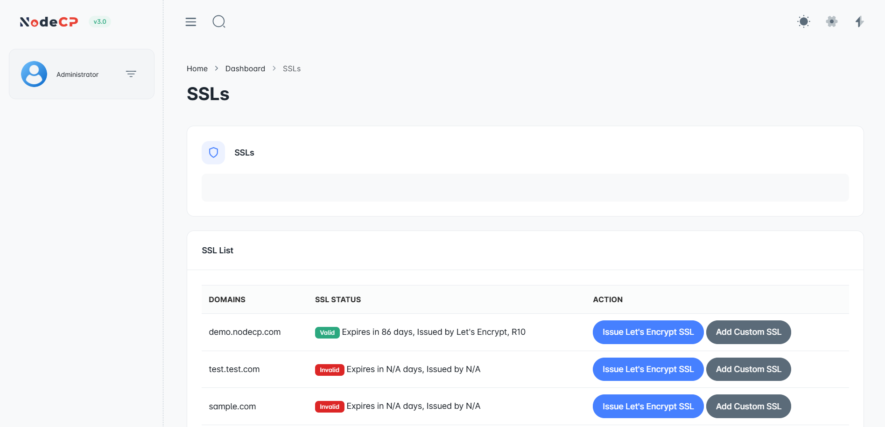
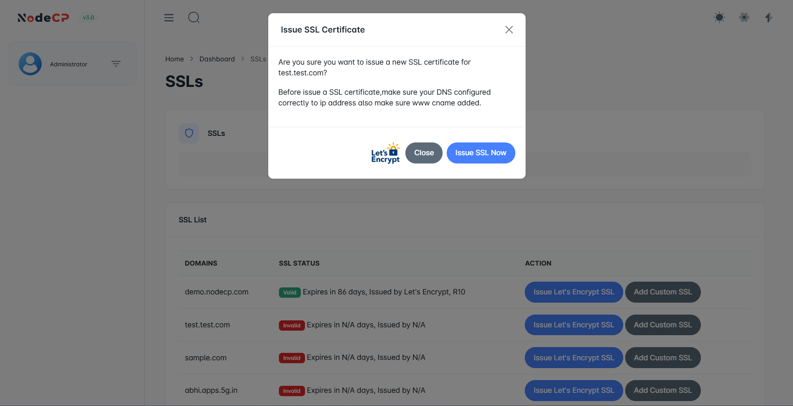
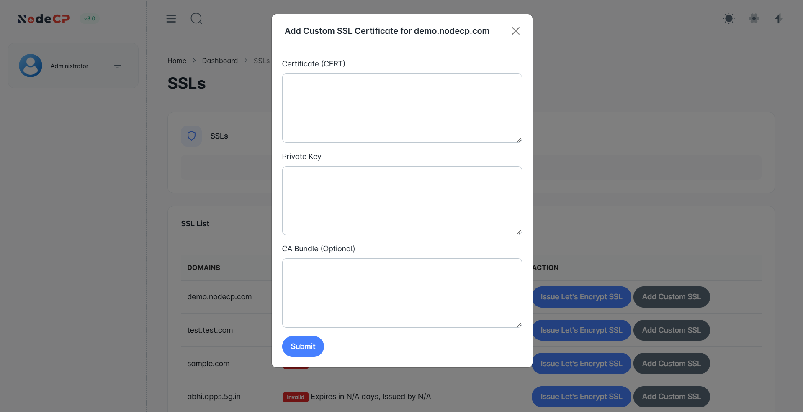

# SSL Management

## Overview

NodeCP provides **secure SSL management**, allowing users to:
- ✅ **Generate free SSL certificates** using [Let's Encrypt](https://letsencrypt.org/) (open-source, free SSL provider).
- ✅ **Manually add custom SSL certificates**.
- ✅ **Ensure secure HTTPS encryption** for all domains.
- ✅ **Verify SSL validity** and renewal status.

---

## 1️⃣ **Managing SSL Certificates**



The **SSL List** displays:
- **Domains** ➜ The associated domain names.
- **SSL Status**:
  - ✅ **Valid** ➜ SSL is active (displays expiration date).
  - 🔴 **Invalid** ➜ No SSL is installed or expired.
- **Actions**:
  - 🌍 **Issue Let's Encrypt SSL** ➜ Get a free SSL certificate.
  - 🔑 **Add Custom SSL** ➜ Use your own SSL certificate.

---

## 2️⃣ **Issuing a Free SSL with Let's Encrypt**



To generate a **free SSL certificate**:
1. Click **"Issue Let's Encrypt SSL"** for your domain.
2. The system will:
   - Verify the **domain's DNS settings**.
   - Request a certificate from **Let's Encrypt**.
   - Install the SSL upon success.
3. If successful, the **SSL status** will update to ✅ **Valid**.

> ⚠️ If you encounter an **error**, check:
- ✅ Your **DNS settings** ➜ The domain **must resolve correctly** to the server.
- ✅ Port **80 & 443 are open** for validation.
- ✅ The domain **is reachable over HTTP** before requesting an SSL.

---

## 3️⃣ **Adding a Custom SSL Certificate**



If you have a **third-party SSL certificate**, you can manually install it:
1. Click **"Add Custom SSL"**.
2. Enter:
   - **SSL Certificate** (`.crt` file content).
   - **Private Key** (`.key` file content).
   - **CA Bundle** (if required by your provider).
3. Click **"Install SSL"**.

> **Note:** Custom SSLs require manual renewal upon expiration.

---

## 4️⃣ **Troubleshooting SSL Issues**

| Issue | Cause | Solution |
|-------|-------|----------|
| **Let's Encrypt SSL fails** | Incorrect DNS records | Ensure your domain resolves correctly |
| **SSL not working** | Port 443 blocked | Open ports 80 & 443 in your firewall |
| **SSL expired** | Auto-renewal failure | Renew manually or check cron jobs |
| **Website still shows HTTP** | Browser cache | Clear cache or check `.htaccess` redirect |

To manually check SSL validity:
```sh
openssl s_client -connect yourdomain.com:443 -servername yourdomain.com
