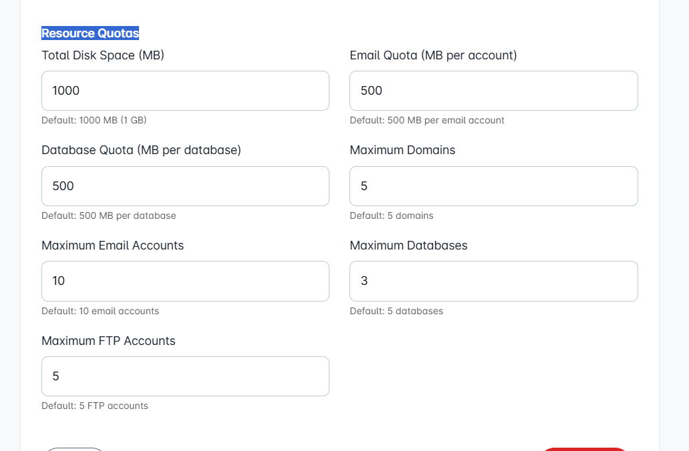

# 🛡️ Users/Moderators Access Management

NodeCP provides a flexible **user and moderators management system**. You can add, edit, or delete users and assign permissions and resource quotas for controlled access.

---

## 👥 **Creating New Users**

To create a new user:

1. Navigate to the **Users/Moderators Access** section.
2. Click **"+ Add User"**.
3. Fill in:
    - **Username**
    - **Email**
    - **Password** & confirm password
    - **Account Status** (Active/Inactive)
3. Assign **domain access permissions** and **module-specific permissions**.
4. Set appropriate **Resource Quotas** (disk space, email quota, domains allowed, databases, FTP accounts, etc.).
5. Click on **"Save User"** to finalize creation.

---

## ✏️ **Editing User Permissions and Quotas**

To modify an existing user:

- Select a user from the list.
- Update details such as:
  - **Email**
  - **Password** (optional)
  - **Module Permissions** (File Manager, Databases, Emails, FTP, SSL, Cron Jobs, DNS, etc.)
  - **Resource Quotas** (Disk space, Email, Database size, domains, FTP accounts, etc.).

Click **"Save"** after making necessary changes.

---

## 📉 **Managing Resource Quotas**

When editing or creating users, you can specify resource quotas clearly:

| Resource Type | Description | Default Value |
|---------------|-------------|---------------|
| 💾 **Disk Space (MB)** | Total disk space available for the user | 1000 MB (1 GB) |
| 📧 **Email Quota** | Storage limit per email account | 500 MB |
| 🗃 **Database Quota** | Maximum database size allowed per database | 1000 MB |
| 🌐 **Max Domains** | Maximum number of domains the user can manage | 5 Domains |
| 📂 **FTP Accounts** | Maximum number of FTP accounts user can create | 5 Accounts |

---

## 🔐 **Assigning Module Permissions**

Control module permissions for each user:

- ✅ **File Manager** (View, Edit, Create, Delete)
- ✅ **Domain Manager**
- ✅ **DNS Management**
- ✅ **SSL Management**
- 📅 **Cron Jobs Management**
- 🌍 **FTP User Management**
- 🔥 **Firewall Management**
- 🔑 **SSH Terminal**
- 🛠️ **Server Setup**
- 🔎 **Access Logs**
- 📥 **Backup Management**
- ⚙️ **Single Installer**
- 📌 **WordPress Management**

Assign permissions according to your organization's security policy.

---

## 🗑️ **Deleting Users**

To remove a user:

- Locate the user in the list.
- Click the red **"Delete"** button.
- Confirm deletion action when prompted.

> **Warning**: Deletion is permanent and cannot be undone. Make sure you back up necessary data before deleting the user.

---

## 🛡️ **Security Best Practices**

- Regularly review user permissions and quotas.
- Grant **minimum necessary permissions** to prevent unauthorized access.
- Keep **strong passwords** for all users.
- Encourage users to enable **Two-Factor Authentication** for better security.

---

🎯 **Efficiently manage your NodeCP users and moderators with ease and precision!** 🚀
