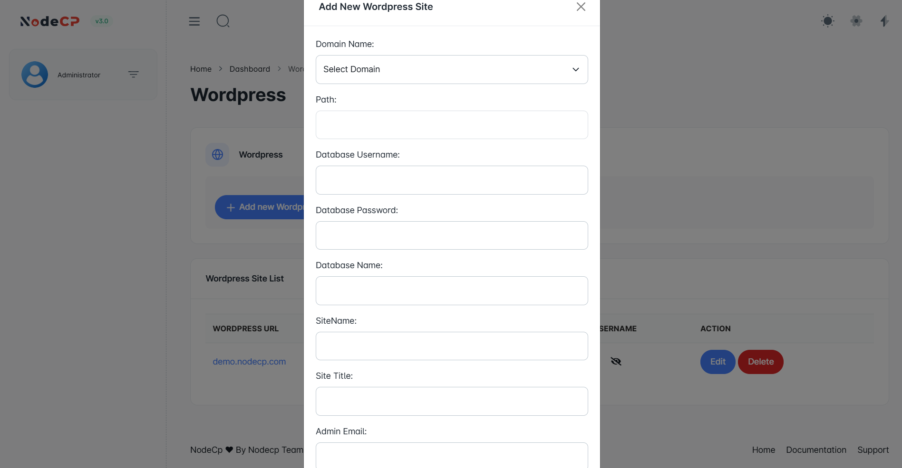

# WordPress Installation

## Overview

NodeCP allows users to **easily install WordPress** with a few clicks. This feature provides:
- ✅ **Automated WordPress setup** with database configuration.
- ✅ **Quick installation** for selected domains.
- ✅ **Admin credentials** setup for instant access.

---

## 1️⃣ **Installing WordPress**

To install **WordPress**, follow these steps:

1. Click **"Add new WordPress"**.
2. Enter the required details:
   - **Domain Name** ➜ Select the domain where WordPress will be installed.
   - **Path** ➜ Leave empty for root installation or specify a subdirectory.
   - **Database Username** ➜ MySQL database username for WordPress.
   - **Database Password** ➜ Secure password for the database.
   - **Database Name** ➜ Name of the WordPress database.
   - **Site Name** ➜ The name of the WordPress site.
   - **Site Title** ➜ Title that will be displayed on the website.
   - **Admin Email** ➜ Email address for the WordPress admin account.
   - **Admin Username** ➜ Login username for the admin panel.
   - **Admin Password** ➜ Secure password for the admin account.

3. Click **"Install WordPress"**.
4. Wait for the installation process to complete.
5. Access your new **WordPress site** at:
   - `https://yourdomain.com`
   - Admin Panel: `https://yourdomain.com/wp-admin/`

> **WordPress is now successfully installed!** 🎉

---

## 2️⃣ **Managing WordPress Sites**

After installation, all WordPress sites will be listed with the following actions:

- **🌍 View Website** ➜ Open the installed WordPress site.
- **✏️ Edit** ➜ Modify database credentials or other settings.
- **❌ Delete** ➜ Remove the WordPress site completely.

> **Caution:** Deleting a WordPress site will remove all files and associated databases.

---

## 3️⃣ **Securing Your WordPress Site**

To ensure security, follow these best practices:

- **Use strong admin credentials** ➜ Avoid common usernames like `admin`.
- **Enable automatic updates** ➜ Keep WordPress, themes, and plugins updated.
- **Install a security plugin** ➜ Use tools like **Wordfence** or **iThemes Security**.
- **Backup regularly** ➜ Store backups using **NodeCP's backup system**.

---

## 🚀 **Why Use NodeCP for WordPress?**
- **One-click installation** ➜ No manual setup required.
- **Database auto-configuration** ➜ No need to create databases manually.
- **Easy management** ➜ View, edit, or delete sites effortlessly.

🎯 **With NodeCP, setting up WordPress is quick, simple, and efficient!** 🚀
